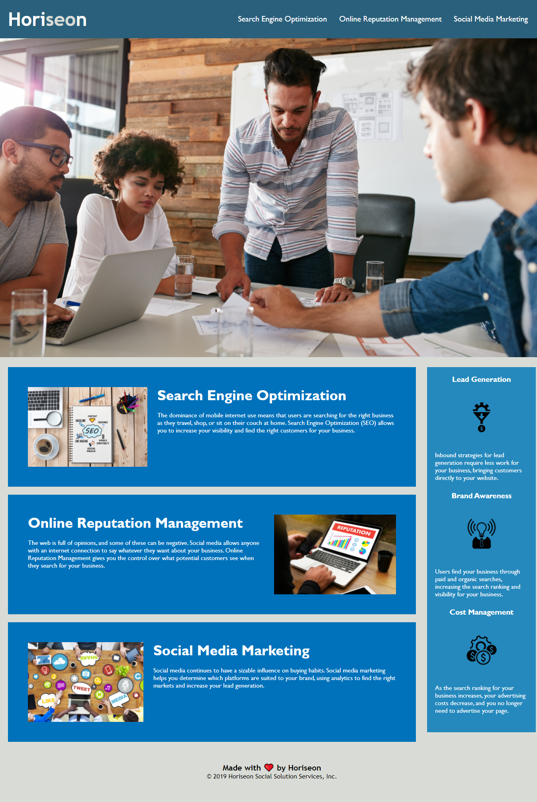

<h1 align="center"> Horiseon Refactor</h1>

## My Goals

<ul>
    <li>As A marketing agency I want a codebase that follows accessibility standards so that our own site is optimized for search engines
</ul>

## What I've done
   
<ul>
    <li> Removed all "div" elements and replaced them with semantic elements </li>
    <li> Refactored CSS to consolidate code from 400 to 133 lines </li>
    <li> Made site more accessible by adding "alt" tags to all images</li>
    <li> Fixed a broken link within the HTML</li>
    <li> Added a title to the Webpage </li>
    <li> Re-Organized CSS file to match the order of the HTML</li>
</ul>

 

## Live Site:

 

 
  
  

 ### Links:

<a href="url"> https://bmorrissey34.github.io/Code-Refactor-Live/</a>

        

    
    
     

